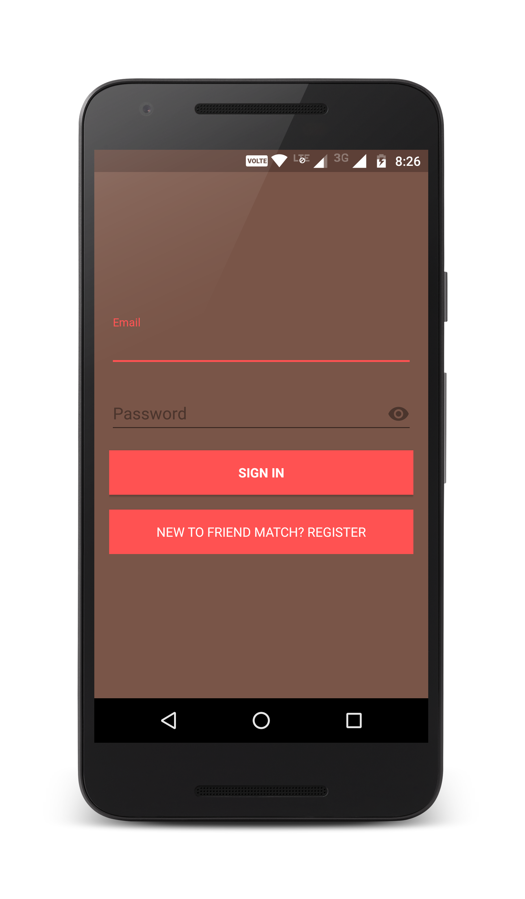

# FriendMatch (Front End)
Android app of [FriendMatch](https://devipriyasarkar.github.io/FriendMatch/) - a platform that finds you friends and suggests events based on your hobbies.  

DBMS Project by [Devipriya Sarkar](https://github.com/DevipriyaSarkar) and [Namita Roy](https://github.com/namitaroy63)

## Download
Download app from [here](https://github.com/DevipriyaSarkar/FriendMatch-Frontend/releases).

## Setup

To run the app on your local server, set up the local server using the instruction given [here] (https://github.com/DevipriyaSarkar/FriendMatch-Backend#setup-instructions).

To run the app permanently on the local server, go to ```application/AppController.java``` and update LOCAL_IP_ADDRESS to ```http://<your-local-ip-address:endpoint>``` and set SERVER_URL to LOCAL_IP_ADDRESS. 

eg.

```
public static String LOCAL_IP_ADDRESS = "http://192.168.1.107:5000";
public static String SERVER_URL = LOCAL_IP_ADDRESS;
```

## Screenshots




## License
The content of this repository is licensed under [MIT LICENSE](LICENSE).
